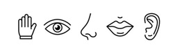

# Normativa en Aplicaciones Web y Móviles

La accesibilidad digital está regulada por una serie de normas internacionales que garantizan el derecho de todas las personas a participar en igualdad de condiciones en la sociedad de la información. La referencia principal es la **[Web Content Accessibility Guidelines (WCAG)](https://www.w3.org/WAI/standards-guidelines/wcag/)**, desarrolladas por el **[World Wide Web Consortium (W3C)](https://www.w3.org/)**.  

El cumplimiento de estas directrices es esencial en el desarrollo de aplicaciones web y móviles, no solo por motivos legales, sino también éticos y sociales. Aplicarlas mejora la experiencia de usuario, aumenta el alcance de los productos digitales y evita situaciones de exclusión.

 <!-- Imagen sugerida: un documento o icono oficial representando normativa -->

## Principios Fundamentales de las WCAG

Las WCAG se estructuran en torno a **cuatro principios fundamentales**, que forman la base de un diseño inclusivo:

1. **Perceptible**: la información y los componentes de la interfaz deben presentarse de manera que los usuarios puedan percibirlos.  


2. **Operable**: la interfaz debe ser utilizable a través de diferentes dispositivos y formas de interacción (teclado, voz, pantalla táctil, etc.).  


3. **Comprensible**: el contenido y el funcionamiento de la interfaz deben ser fáciles de entender.  


4. **Robusto**: el contenido debe poder ser interpretado de forma fiable por una amplia variedad de agentes de usuario, incluidas las tecnologías de apoyo.  


## Niveles de Conformidad

Las WCAG definen **tres niveles de conformidad** que permiten medir el grado de accesibilidad alcanzado:

- **Nivel A**: requisitos mínimos que garantizan la accesibilidad básica.  
- **Nivel AA**: nivel intermedio, considerado estándar en la mayoría de legislaciones.  
- **Nivel AAA**: nivel más alto, que asegura la mejor experiencia inclusiva posible.  

 <!-- Imagen sugerida: pirámide o escalera con tres niveles -->

- **Nivel A (mínimo)**:

<details>
<summary> Texto alternativo en imágenes</summary>
```html 

```
</details>

<details>
<summary> Navegación mediante teclado</summary>
```html 
<button onclick="alert('¡Botón activado!')">Haz clic o pulsa Enter</button>
```
</details>

<details>
<summary> Evitar contenido parpadeante</summary>
```html 
<!-- Ejemplo correcto: imagen estática en lugar de un GIF que parpadea -->

```
</details>

- **Nivel AA (intermedio)**:

<details>
<summary> Contraste de color suficiente (mínimo 4.5:1)</summary>
```html 
<style>
  body {
    background-color: #ffffff; /* blanco */
    color: #333333;            /* gris oscuro, contraste 15.3:1 */
  }
</style>
<p>Texto con contraste accesible sobre fondo blanco.</p>
```
</details>

<details>
<summary> Subtítulos en vídeos pregrabados</summary>
```html 
<video controls>
  <source src="clase.mp4" type="video/mp4">
  <track src="subtitulos.vtt" kind="subtitles" srclang="es" label="Español">
</video>
```
</details>

<details>
<summary> Etiquetas claras en formularios</summary>
```html 
<form>
  <label for="email">Correo electrónico</label>
  <input type="email" id="email" name="email">
  
  <button type="submit">Enviar</button>
</form>
```
</details>


## Relevancia Legal en Europa y España

En la Unión Europea, la **[Directiva 2016/2102](https://eur-lex.europa.eu/legal-content/ES/ALL/?uri=CELEX:32016L2102)** establece la obligación de que los sitios web y aplicaciones móviles de los organismos públicos cumplan con las WCAG 2.1 en nivel AA.  

En España, esta directiva se transpone a través del **[Real Decreto 1112/2018](https://www.boe.es/diario_boe/txt.php?id=BOE-A-2018-12699)**, que obliga a las administraciones públicas y a determinados servicios de interés general a garantizar la accesibilidad digital.  

Cumplir con la normativa no solo evita sanciones, sino que también promueve una sociedad más justa e inclusiva.


 <!-- Imagen sugerida: icono de balanza o documento legal -->

 **[WCAG 2.1](https://www.w3.org/TR/WCAG21/)**
