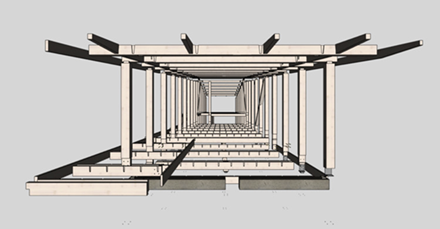
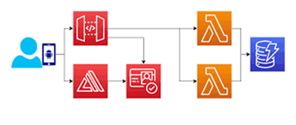
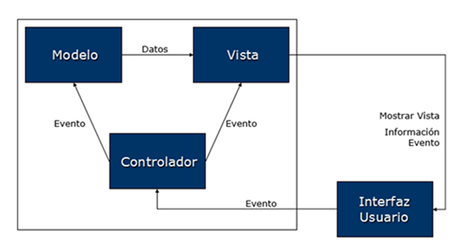
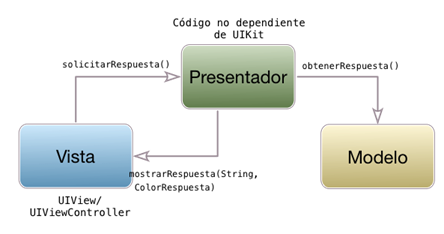
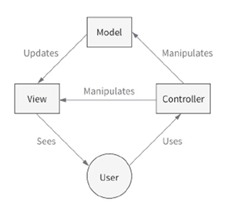
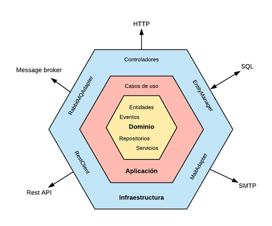
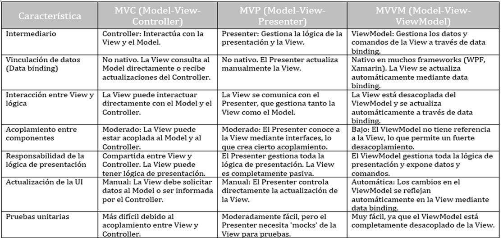

# Arquitectura de Aplicaciones Móviles

La arquitectura de una aplicación móvil define la organización interna de sus componentes y cómo se comunican entre sí. Constituye el esqueleto que sostiene el desarrollo y mantenimiento de la app, asegurando escalabilidad, calidad y facilidad de evolución. En el contexto de PAMN, comprender la arquitectura es fundamental para formar profesionales capaces de crear aplicaciones robustas y alineadas con las buenas prácticas de la industria.

## Objetivos de la arquitectura

- Proporcionar un marco estructurado para el desarrollo.  
- Asegurar la separación de responsabilidades.  
- Facilitar la escalabilidad y la mantenibilidad.  
- Simplificar la integración de nuevas funcionalidades.  
- Reforzar la seguridad y el control del proyecto.  

## ¿Por qué es importante?

Una buena arquitectura:

- **Estructura**: Una arquitectura sólida proporciona un esqueleto robusto para el Proyecto, asegurando que cada componente encaje de manera coherente y eficiente. 

- **Planificación**: Facilita la toma de decisiones anticipadas, permitiendo evitar posibles obstáculos y puntos críticos en el desarrollo. 

- **Control**: Con una arquitectura bien definida, es  más sencillo monitorizar el progreso, identificar desviaciones  y garantizar que el Proyecto se mantenga en el camino correcto.

 

- **Optimización del proceso**: Una  buena arquitectura simplifica la integración de nuevas características y facilita las actualizaciones, asegurando la escalabilidad y adaptabilidad del Proyecto a largo plazo. 

 

- **Separación de capas**: Consiste en dividir un sistema en capas o módulos independientes, cada uno con una responsabilidad específica. Podemos distinguir entre presentación, lógica de negocio y gestión de datos.

 

## Modelos de arquitectura más utilizados

### 1. MVC (Modelo–Vista–Controlador)

Separa la app en tres componentes principales: modelo, vista y controlador. 

- **Modelo**: Datos y lógica de negocio.  
- **Vista**: Interfaz gráfica.  
- **Controlador**: Actúa como intermediario, manejando la entrada del usuario y actualizando tanto la vista como el modelo.  

Ventajas: La separación clara entre la lógica de la interfaz de usuario y la lógica de negocio.  
Inconvenientes: El controlador tiende a sobrecargarse en proyectos grandes. La vista y el controlador suelen estar más acoplados en en otras arquitecturas. 

### 2. MVP (Modelo–Vista–Presentador)

Separa la lógica de presentación de la lógica de negocio.

- **Modelo**: Mantiene datos y reglas de negocio.  
- **Vista**: Muestra información, delega lógica.  
- **Presentador**: Gestiona la lógica de negocio y actualiza la vista.  

Ventajas: La separación clara entre la lógica de la interfaz de usuario y la lógica de negocio. Facilita una alta testabilidad.  
Inconvenientes: Puede generar código más complejo.  

### 3. MVVM (Modelo–Vista–VistaModelo)

Arquitectura que utiliza un modelo de vista para gestionar la lógica de la aplicación.

- **Modelo**: Gestiona datos y lógica de negocio.  
- **Vista**: Muestra la interfaz y se comunica con la vista modelo.  
- **VistaModelo**: Maneja la lógica de presentación y comunica vista y modelo.  

Ventajas: menor acoplamiento y compatible con programación reactiva.  

 **[Modelo–Vista–VistaModelo (MVVM)](mvvm.md)**.

### 4. MVI (Modelo–Vista–Intención)

Se centra en la intención del usuario y utiliza un flujo de datos unidireccional.

- **Modelo**: Datos y lógica de negocio.  
- **Vista**: Muestra el estado actual de la aplicación.  
- **Intenciones**: Representa las intenciones o acciones del usuario.   

Ventaja principal: Enfoque cíclico y reactivo que maneja el flujo de datos y eventos.  

### 5. Arquitectura Hexagonal

Divide la app en capas:

- **Núcleo**: Dominio que representa la lógica de negocio.  
- **Aplicación**: Maneja los casos de uso.  
- **Infraestructura**: Maneja los adaptadores de infraestructura, incluyendo los controladores (adaptadores que manejan la interfaz de usuario).  

Los adaptadores se conectan a los puertos.
El diagrama sigue el principio de desacoplamiento de la arquitectura hexagonal. La lógica de negocio está completamente aislada de los detalles de implementación externa (infraestructura, tecnologías). Las interacciones entre la aplicación y el mundo exterior se realizan a través de puertos y adaptadores, lo que garantiza que el núcleo del sistema sea independiente de la infraestructura.
Este patrón facilita el cambio de tecnologías externas sin modificar el núcleo, promueve la testabilidad y permite que cada componente sea mantenido y desarrollado de manera independiente.

## Factores para elegir la arquitectura. Consideraciones clave.

- **Requerimientos**: Entender las necesidades específicas y objetivos del proyecto para determinar qué arquitectura se alinea mejor.
- **Rendimiento**: Evaluar cómo cada arquitectura puede influir en la velocidad, respuesta y eficiencia del sistema.
- **Integración con otros Sistemas**: Si el proyecto necesita interactuar con otros sistemas o aplicaciones, la arquitectura debe facilitar estas integraciones.
- **Recursos**: Evaluar la inversión necesaria en términos de tiempo, dinero y recursos humanos para implementar y mantener
- **Seguridad**: Garantizar que la arquitectura elegida ofrezca las medidas de seguridad adecuadas para proteger datos y procesos.
- **Facilidad de mantenimiento**: La facilidad con la que se pueden hacer cambios, correcciones o mejoras en el sistema a lo largo del tiempo.

## Estructurando aplicaciones.

## Relación con DevOps

La arquitectura móvil está alineada con la filosofía DevOps, ya que:  

- Favorece la automatización de pruebas e integración continua.  
- Permite despliegues más rápidos y seguros.  
- Mejora la observabilidad en producción.  
- Facilita la escalabilidad de las aplicaciones.  

## Conclusiones

- La arquitectura es el pilar central de una app móvil.  
- Existen múltiples patrones (MVC, MVP, MVVM, MVI, Hexagonal), cada uno con pros y contras.  
- La elección depende de los objetivos, recursos y contexto del proyecto.  
- Una arquitectura alineada con DevOps asegura calidad y entrega continua.  