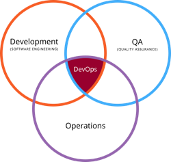

# Ciclo de vida de una aplicación móvil y su relación con DevOps

El ciclo de vida de una aplicación móvil describe todas las fases que atraviesa una app desde su concepción hasta su retirada. Comprender este ciclo permite desarrollar soluciones más robustas, escalables y mantenibles, optimizando recursos y minimizando errores. En el contexto de PAMN, este enfoque es esencial para preparar al estudiante en entornos reales de desarrollo.

## Objetivos del ciclo de vida

- Establecer un marco ordenado para el desarrollo.
- Identificar y controlar riesgos desde fases tempranas.
- Asegurar la calidad del producto desde su diseño.
- Permitir una entrega continua y sostenible.

## Breve historia

Inicialmente, el ciclo de vida del software seguía modelos rígidos como el modelo en cascada, donde cada fase debía completarse antes de pasar a la siguiente. Con la evolución de las metodologías ágiles, se impuso una visión iterativa e incremental del desarrollo, y con la llegada del desarrollo móvil surgieron nuevas necesidades: integración continua, automatización, despliegue frecuente y monitorización en tiempo real. Es aquí donde emerge **DevOps**, una práctica que unifica el desarrollo (Dev) y las operaciones (Ops).

## DevOps como intersección de disciplinas

La imagen anterior representa la integración de tres dimensiones fundamentales: **desarrollo**, **operaciones** y **control de calidad**. El área donde se superponen da lugar al enfoque DevOps, que busca romper los silos tradicionales, fomentar la colaboración entre equipos y automatizar todo lo posible para entregar valor de forma continua al usuario final.

## El ciclo DevOps en acción

Este diagrama muestra el flujo típico de un proceso DevOps, en forma de bucle infinito. Cada etapa está conectada a la siguiente, favoreciendo una entrega continua e integración constante. Las fases principales son:

### 1. **Planificación**
Definición de requisitos, tareas y objetivos. Se pueden utilizar herramientas como Jira, Trello o Azure Boards.

### 2. **Codificación**
Desarrollo de funcionalidades. Aquí se emplean lenguajes como Kotlin, Swift, Dart, Java o frameworks como React Native. Herramientas: Android Studio, Xcode, VS Code.

### 3. **Compilación**
Generación de artefactos ejecutables. Herramientas comunes: Gradle, Maven, Xcode Build.

### 4. **Pruebas**
Ejecutadas de forma automatizada o manual. Destacan frameworks como JUnit, Espresso, XCTest, o pruebas E2E con Appium.

### 5. **Publicación**
Subida a tiendas como Google Play o App Store. Automatizable con Fastlane, GitHub Actions, Bitrise.

### 6. **Despliegue**
Distribución en entornos de producción o pruebas (alpha, beta). Puede hacerse vía Firebase App Distribution o TestFlight.

### 7. **Monitorización**
Análisis del rendimiento y errores. Herramientas típicas: Firebase Crashlytics, Sentry, New Relic.

### 8. **Operaciones**
Gestión de la infraestructura, soporte y mantenimiento. Se apoyan en CI/CD (GitHub Actions, GitLab CI, Jenkins) e infraestructura como código (IaC).

[GitHub actions](github_actions.md "GitHub actions")
