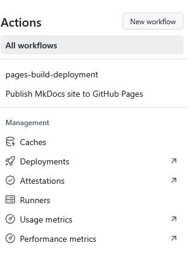

# Gestión de GitHub Actions




## ¿Qué es el caché en GitHub Actions?

Es un **almacenamiento temporal** que guardan los runners de GitHub para evitar descargar o volver a construir dependencias en cada ejecución.

Similar a la instalación de dependencias con `npm install`, `pip install`, `gradle build` o `maven`.  
Normalmente eso se descarga **cada vez que corre el workflow**, lo que lo hace lento.

Con la **caché**, esos archivos (ej. `.m2/repository`, `~/.gradle/caches`, `node_modules`) se guardan en GitHub y se reutilizan en siguientes ejecuciones.

---

## 🔹 ¿Para qué se utiliza?

- **Acelerar workflows**: reduce tiempos de compilación y test.  
- **Ahorrar ancho de banda**: menos descargas de dependencias externas.  
- **Reutilizar entornos**: útil en builds grandes (ejemplo: proyectos Android con Gradle).  

<details>
<summary> Cache </summary>
<p>El caché en GitHub Actions es como una <strong><i>mochila</i> que guarda las dependencias y resultados intermedios entre ejecuciones</strong>, para que los workflows sean mucho más rápidos y eficientes.</p>
</details>

## ¿Qué son los Deployments en GitHub Actions?

Los **deployments** (despliegues) en GitHub Actions representan el proceso de **publicar o entregar software** a un entorno específico: pruebas, staging, producción, etc.  
Permiten que tu código no solo se compile y se pruebe, sino que también llegue de forma controlada a los usuarios finales o a los servidores donde se ejecuta.

---

### 🔹 Características principales
- **Entornos (Environments):** GitHub permite definir entornos como `staging` o `production` con reglas, revisores y protecciones.  
- **Histórico de despliegues:** cada deployment queda registrado, facilitando auditoría y rollback.  
- **Permisos y secretos:** puedes definir secretos distintos por entorno, garantizando seguridad en credenciales (ej. claves de AWS, Firebase, Play Store).  
- **Integración con flujos CI/CD:** se enlazan a los jobs finales de un workflow, tras pasar por build y test.

---

### 🔹 ¿Para qué se utilizan?
- Publicar una aplicación web en **GitHub Pages**, **Netlify** o **Vercel**.  
- Subir un contenedor Docker a **DockerHub** o **GitHub Container Registry**.  
- Distribuir aplicaciones móviles a **Firebase App Distribution**, **Google Play** o **TestFlight**.  
- Desplegar microservicios a **AWS**, **Azure**, **GCP** o **Kubernetes**.  

---

### 🔹 Ejemplo simple (desplegar a GitHub Pages)
```yaml
name: Deploy website
on:
  push:
    branches: [ main ]

jobs:
  deploy:
    runs-on: ubuntu-latest
    steps:
      - uses: actions/checkout@v4
      - name: Build site
        run: |
          npm install
          npm run build
      - name: Deploy to GitHub Pages
        uses: peaceiris/actions-gh-pages@v3
        with:
          github_token: ${{ secrets.GITHUB_TOKEN }}
          publish_dir: ./build
```

En este caso, cada vez que se hace push a `main`, el sitio se compila y se publica automáticamente en GitHub Pages.

---

<details>
<summary> Deployments </summary>
<p>Los <strong>deployments</strong> permiten llevar tu aplicación más allá de la compilación y las pruebas: son el paso en que tu software pasa a estar disponible en un entorno real o para usuarios.  
En GitHub Actions, se gestionan mediante <i>jobs</i> configurados para distintos entornos, con control de permisos, secretos y registros de auditoría.</p>
</details>

## ¿Qué son las *Attestations* en GitHub Actions?

Las **attestations** (atestaciones) son **pruebas criptográficas** que vinculan un **artefacto** (p. ej., un binario, imagen Docker, paquete) con **cómo y dónde fue generado** (workflow, commit, runner, identidad OIDC).  
Su objetivo es mejorar la **seguridad de la cadena de suministro** (Supply Chain Security) proporcionando **provenance** (procedencia) verificable, alineada con estándares como **SLSA**.

---

### 🔹 ¿Para qué se utilizan?
- **Trazabilidad y confianza**: demostrar que un artefacto proviene de un pipeline controlado y de un commit concreto.
- **Cumplimiento**: requisitos de *compliance* (p. ej., políticas internas o clientes que exigen provenance).
- **Verificación antes del despliegue**: políticas que bloquean despliegues si el artefacto no tiene una atestación válida.

---

### 🔹 Conceptos clave
- **Provenance (SLSA)**: metadatos firmados que describen cómo se construyó el artefacto (fuente, builder, parámetros, hash).
- **Firmas**: se apoyan en identidad **OIDC** del workflow y claves gestionadas por GitHub para impedir suplantaciones.
- **Almacenamiento/consulta**: las atestaciones quedan asociadas al artefacto en GitHub y pueden verificarse en tiempo de despliegue.

---

### 🔹 Ejemplo (SLSA build provenance para un binario o paquete)
> Genera una atestación de procedencia para los archivos construidos en `dist/`.

```yaml
name: Build with provenance
on:
  push:
    tags: [ 'v*' ]

permissions:
  contents: read
  id-token: write   # Necesario para atestaciones (OIDC)
  attestations: write

jobs:
  build:
    runs-on: ubuntu-latest
    steps:
      - uses: actions/checkout@v4
      - name: Build
        run: |
          mkdir -p dist
          echo "hello" > dist/app.txt

      - name: Attest build provenance (SLSA)
        uses: actions/attest-build-provenance@v1
        with:
          subject-path: 'dist/*'   # Archivos a atestar (los artefactos)
```
**Cómo funciona:** la acción genera una **atestación SLSA** que vincula los artefactos en `dist/*` con este workflow/commit. Esa prueba se puede verificar antes de desplegar.

<details>
<summary> Attestations </summary>
<p>Las <strong>attestations</strong> son metadatos firmados que prueban <i>quién</i>, <i>cómo</i> y <i>desde qué código</i> se construyó un artefacto. En GitHub Actions se generan con acciones como <code>actions/attest-build-provenance</code> y se apoyan en OIDC para proporcionar una identidad verificable.</p>
</details>

## ¿Qué son los *Runners* en GitHub Actions?

Los **runners** son las **máquinas** (hosted o self-hosted) donde se **ejecutan** los jobs de tus workflows.  
Cada job declara su “destino” con `runs-on` (por ejemplo, `ubuntu-latest`).

---

### 🔹 Tipos de runners
- **GitHub-hosted runners**: máquinas efímeras gestionadas por GitHub (Ubuntu, Windows, macOS).  
  - Ventajas: cero mantenimiento, listos para uso, limpieza por job.  
  - Ejemplos: `ubuntu-latest`, `windows-latest`, `macos-latest`.  
- **Self-hosted runners**: máquinas que tú administras (on-premise o cloud) y que registras en tu repo/organización.  
  - Ventajas: control total, hardware especializado (GPU), acceso a redes internas.  
  - Requiere mantenimiento, actualización y seguridad propias.

---

### 🔹 Selección por etiquetas (labels)
- `runs-on` acepta **una etiqueta** (p. ej. `ubuntu-latest`) o **varias** (para self-hosted se usan combinadas).  
- Puedes agrupar runners y asignar etiquetas como `self-hosted`, `linux`, `gpu`, `arm64` para enrutar jobs.

```yaml
# GitHub-hosted
jobs:
  build:
    runs-on: ubuntu-latest
    steps:
      - uses: actions/checkout@v4
      - run: echo "Hello from GitHub-hosted runner"
```

```yaml
# Self-hosted con etiquetas
jobs:
  build:
    runs-on: [ self-hosted, linux, x64 ]
    steps:
      - uses: actions/checkout@v4
      - run: ./gradlew build
```

---

### 🔹 Buenas prácticas y opciones útiles
- **Concurrencia** y **timeouts** para evitar jobs colgados:  
  ```yaml
  concurrency: project-ci-${{ github.ref }}
  jobs:
    build:
      runs-on: ubuntu-latest
      timeout-minutes: 30
  ```
- **Matriz de estrategias** para probar múltiples entornos:  
  ```yaml
  jobs:
    test:
      runs-on: ubuntu-latest
      strategy:
        matrix:
          java: [17, 21]
          os: [ubuntu-latest, windows-latest]
      steps:
        - uses: actions/checkout@v4
        - uses: actions/setup-java@v4
          with:
            distribution: temurin
            java-version: ${{ matrix.java }}
        - run: ./gradlew test
  ```
- **Seguridad en self-hosted**: ejecutar como usuarios con privilegios mínimos, aislar en redes, rotar tokens/labels, y actualizar el agente con frecuencia.

<details>
<summary> Runners </summary>
<p>Un <strong>runner</strong> es la máquina que ejecuta tus jobs. GitHub te ofrece runners hospedados listos para usar, o puedes registrar los tuyos (self-hosted) si necesitas hardware o red específicos. Se seleccionan con <code>runs-on</code> y etiquetas.</p>
</details>

---

[Ejemplo práctico](../../files/Practicas.zip)
