# Fases de diseño

## Fases

### Análisis

---
### Definición

---
### Diseño

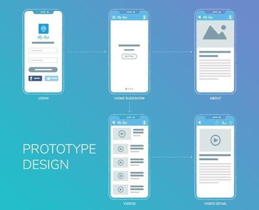

---
### Desarrollo

---

### Publicación

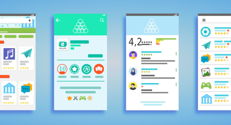

---

### Proceso

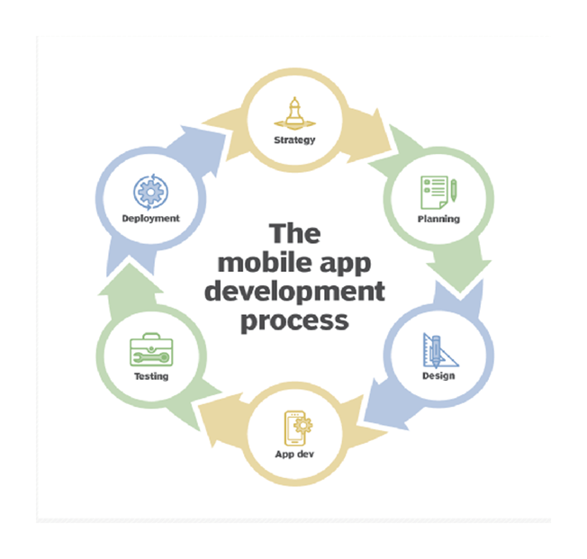
---

## Ejemplos

### Carrefur

---

### Mercadona

---
### Guaguas

---
### Placas solares

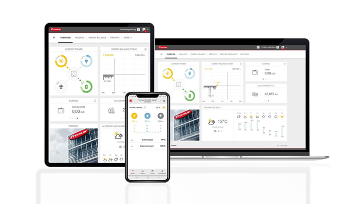

---
### Carga Wallbox

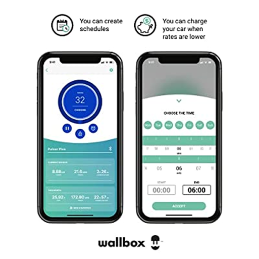

---
### Android

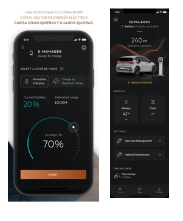

---
### Vinos

---
### Yuka

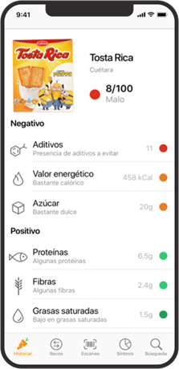

---
### Facebook

---
### WhatsApp

---
### Path

---
### Resoluciones

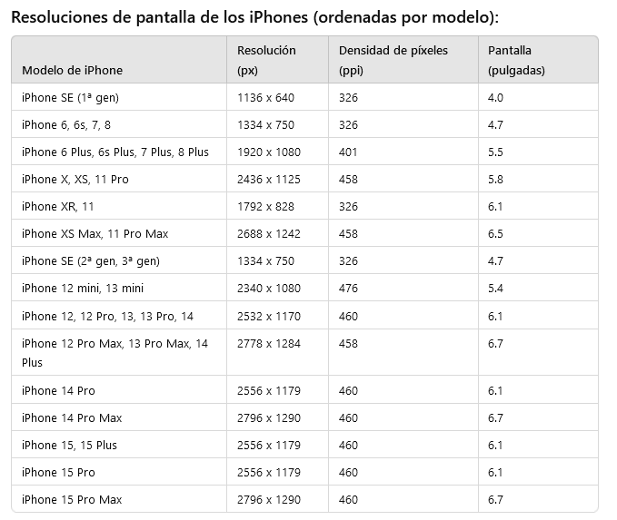

---
### Características

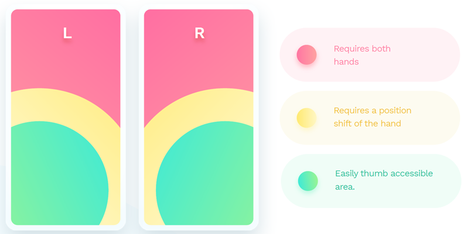

### Design Thinking process model

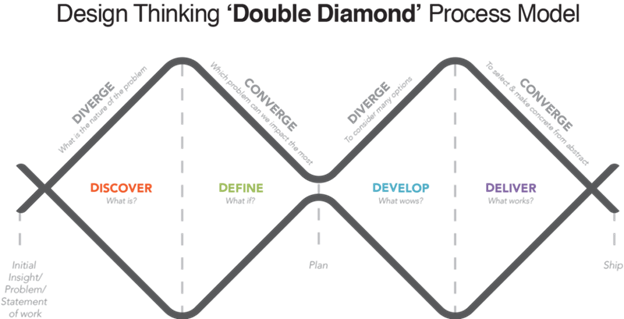

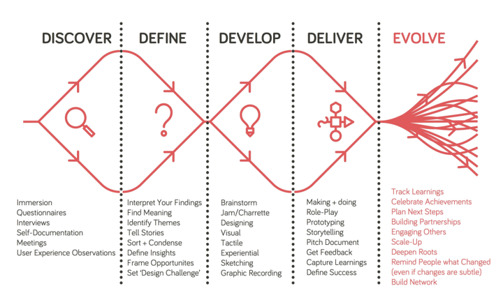