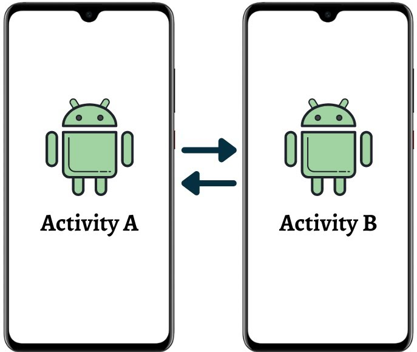
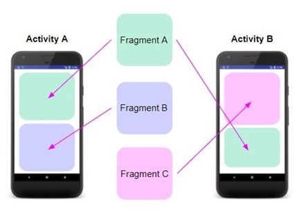
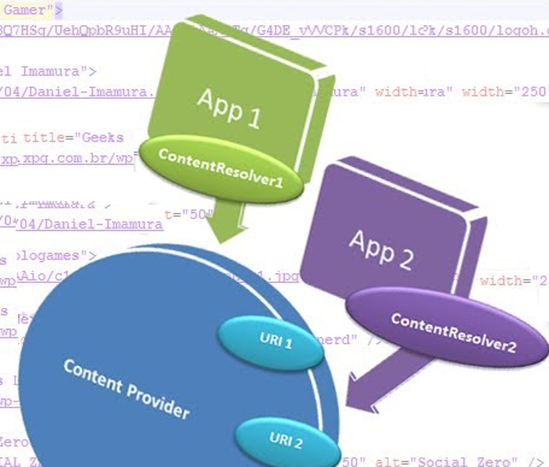
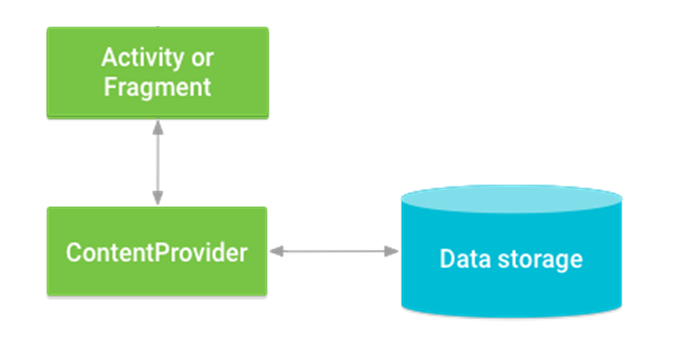

# Arquitectura base y componentes del sistema Android

## Introducción
Las aplicaciones Android están formadas por un conjunto de componentes que trabajan de manera coordinada bajo la gestión del sistema operativo. Cada componente cumple una función específica y tiene un ciclo de vida propio, gestionado por el sistema según las necesidades de recursos y contexto.

Comprender esta arquitectura es esencial para diseñar aplicaciones eficientes, seguras y escalables. En este tema exploraremos cómo Android organiza las aplicaciones, qué papel desempeña cada componente y cómo se comunican entre ellos.

---

## Arquitectura de una aplicación Android
Una aplicación Android se compone de varias capas interdependientes:

1. **Aplicación** → Las Activities, Fragments, Services, etc. que construyen la funcionalidad visible y la lógica de la app.
2. **Framework de Android** → Proporciona las APIs principales que permiten interactuar con el sistema operativo.
3. **Bibliotecas del sistema** → Conjunto de librerías C/C++ que implementan componentes fundamentales (gráficos, base de datos, multimedia).  
4. **Kernel de Linux** → Gestiona memoria, procesos, seguridad y comunicación entre hardware y software.

Android gestiona los procesos de las aplicaciones de forma dinámica. Cada app se ejecuta en su propio proceso, con su propio espacio de memoria, y el sistema puede pausar o destruir componentes para liberar recursos sin afectar a otras apps.

---

## Componentes fundamentales de una aplicación Android
Los seis componentes principales son las piezas clave que el sistema utiliza para ejecutar, mostrar información, comunicarse y compartir datos entre aplicaciones.

### Activity
**Definición:** Una Activity representa una pantalla con la que el usuario puede interactuar directamente. Es el punto de entrada más habitual de una aplicación.



**Funciones principales:**
- Gestionar la interfaz de usuario (UI) y las interacciones del usuario.
- Coordinar el ciclo de vida de la pantalla y los recursos asociados.

**Métodos clave del ciclo de vida:**  
- `onCreate()` → Inicializa la actividad y configura la interfaz.  
- `onStart()` → Hace visible la Activity.  
- `onResume()` → La Activity pasa a primer plano y es interactiva.    
- `onPause()` → Se pausa cuando otra Activity toma el foco.  
- `onStop()` → Deja de ser visible.  
- `onDestroy()` → Se libera la memoria asociada.  

**Ejemplo:**   Pantalla de inicio de sesión que contiene campos de usuario y contraseña. Cuando el usuario rota el dispositivo, el estado debe guardarse para restaurarse al volver a `onResume()`.

**Buenas prácticas:**  
- Evitar operaciones pesadas en `onCreate()` o `onResume()`.  
- Utilizar `ViewModel` y `LiveData` para preservar el estado.  
- Dividir la lógica de UI en Fragments para modularidad. 


[Activity Life Cycle Zoom](ativitylifecycle.md)

<details>
  <summary>Activity ejemplo</summary>
  <p><strong>Imagina que la "actividad"</strong> es la experiencia completa de ir a ver una película al cine. Esta actividad tiene diferentes estados que corresponden al ciclo de vida de una actividad en Android:</p>

  <p><strong>➤ onCreate() (Actividad creada):</strong><br>
  Este sería el momento en el que decides ir al cine y empiezas a preparar todo. Te pones los zapatos, coges las llaves del coche y sales de casa.<br>
  Es el inicio de la actividad: se están configurando las cosas necesarias para que la experiencia pueda llevarse a cabo.</p>

  <p><strong>➤ onStart() (Actividad visible):</strong><br>
  Has llegado al cine y ya compraste las entradas. Ahora estás en el pasillo, visible para otros, pero aún no has comenzado a ver la película.<br>
  La actividad está "visible" en el sentido de que ya estás en el cine, pero la experiencia principal (ver la película) todavía no ha comenzado.</p>

  <p><strong>➤ onResume() (Actividad en primer plano):</strong><br>
  Entras a la sala, te sientas, y la película comienza a reproducirse. Ahora estás completamente inmerso en la actividad de ver la película.<br>
  Este es el momento en el que la actividad está en "primer plano" y es la experiencia principal en la que te estás enfocando.</p>

  <p><strong>➤ onPause() (Actividad parcialmente oculta):</strong><br>
  Imagina que durante la película tienes que salir de la sala por un momento para contestar una llamada telefónica.<br>
  La película sigue en curso, pero tú no estás prestando atención activa. La actividad está en pausa, ya que has salido temporalmente del cine.</p>

  <p><strong>➤ onStop() (Actividad ya no visible):</strong><br>
  Terminas tu llamada, pero decides no volver a la sala de inmediato, tal vez te quedas en el pasillo hablando con alguien.<br>
  La película sigue proyectándose, pero ya no estás en la sala. La actividad no es visible para ti en este momento.</p>

  <p><strong>➤ onRestart() (Actividad vuelve a ser visible):</strong><br>
  Decides volver a la sala de cine y continuar viendo la película. La actividad se reinicia y se convierte en el centro de tu atención nuevamente.<br>
  Esto es similar a cómo una actividad en Android puede volver al primer plano después de haber sido detenida.</p>

  <p><strong>➤ onDestroy() (Actividad destruida):</strong><br>
  La película termina, te levantas y sales del cine. La experiencia de ver la película ha llegado a su fin.<br>
  En este punto, la actividad se destruye, y cualquier cosa relacionada con la experiencia de la película se da por concluida.</p>
</details>

---

### Fragment
**Definición:** Un Fragment es un componente reutilizable que forma parte de la interfaz de una Activity. Permite dividir una pantalla en secciones modulares.



**Funciones principales:**  
- Facilitar interfaces dinámicas y adaptables (por ejemplo, para tablets).  
- Compartir la lógica entre diferentes pantallas.  

**Ciclo de vida simplificado:**  
- `onAttach()` → El fragment se asocia a la Activity.  
- `onCreateView()` → Se infla el diseño (layout) del fragment.  
- `onViewCreated()` → Se inicializa la lógica de la interfaz.  
- `onPause()` / `onStop()` / `onDestroyView()` → Se limpian los recursos visuales.

[Inflar](inflar.md "Inflar")

**Ejemplo:** Una app de noticias donde un fragment muestra la lista de artículos y otro el detalle del artículo seleccionado.

**Buenas prácticas:**  
- Evitar dependencias directas entre Fragments: usar `ViewModel` compartido o el componente de navegación (`NavController`).  
- No mantener referencias a vistas fuera de su ciclo de vida (`onDestroyView()`).


<details>
  <summary>Fragment ejemplo</summary>

  <p><strong>Imagina que cada fragmento</strong> es como una sección de una feria. Cada fase del ciclo de vida del fragmento corresponde a lo que ocurre con esa sección durante toda la feria.</p>

  <p><strong>➤ onAttach() (El fragmento se adjunta a la actividad):</strong><br>
  Es el momento en que los organizadores asignan el espacio físico para una sección de la feria y comienzan a instalarla (por ejemplo, la entrada principal con señalizaciones).<br>
  En Android, significa que el fragmento se ha asociado a la actividad que lo contendrá.</p>

  <p><strong>➤ onCreate() (Creación del fragmento):</strong><br>
  La sección se empieza a preparar: decoraciones, folletos y personal, aunque la feria todavía no está abierta al público.<br>
  En un fragmento, se inicializan recursos necesarios, pero aún no se ha creado la interfaz visual.</p>

  <p><strong>➤ onCreateView() (Creación de la vista):</strong><br>
  Se montan las mesas, los productos y todo lo visible para los visitantes.<br>
  En Android, aquí se crea la interfaz de usuario del fragmento.</p>

  <p><strong>➤ onActivityCreated() (La actividad ha completado su creación):</strong><br>
  La feria abre sus puertas al público. Los visitantes ya pueden recorrer las secciones.<br>
  En Android, el fragmento y su actividad están completamente inicializados y listos para funcionar.</p>

  <p><strong>➤ onStart() (El fragmento es visible):</strong><br>
  La sección está abierta y visible para los visitantes, aunque aún no está en plena interacción.<br>
  En Android, la vista del fragmento ya es visible en pantalla.</p>

  <p><strong>➤ onResume() (El fragmento está activo y en primer plano):</strong><br>
  Los visitantes interactúan, preguntan, ven demostraciones y participan activamente.<br>
  En Android, el fragmento está completamente activo y el usuario puede interactuar con él.</p>

  <p><strong>➤ onPause() (El fragmento está parcialmente oculto):</strong><br>
  Algunos visitantes se van a otras secciones, aunque todavía pasa gente ocasionalmente.<br>
  En Android, el fragmento sigue visible parcialmente, pero ha perdido el foco.</p>

  <p><strong>➤ onStop() (El fragmento ya no es visible):</strong><br>
  La sección se cierra temporalmente, quizá para mantenimiento. Ya no hay visitantes.<br>
  En Android, el fragmento ya no está visible, aunque sigue existiendo en memoria.</p>

  <p><strong>➤ onDestroyView() (Vista del fragmento destruida):</strong><br>
  Se desmontan los elementos visibles de la sección (mesas, carteles), pero la estructura sigue existiendo.<br>
  En Android, se elimina la vista del fragmento, pero el objeto fragment aún existe.</p>

  <p><strong>➤ onDestroy() (El fragmento se destruye por completo):</strong><br>
  La sección de la feria termina, se retiran todos los elementos y recursos.<br>
  En Android, el fragmento libera todos sus recursos y se destruye.</p>

  <p><strong>➤ onDetach() (El fragmento se desacopla de la actividad):</strong><br>
  La sección se elimina por completo del evento, ya no forma parte de la feria.<br>
  En Android, el fragmento se desacopla de la actividad, dejando de tener referencia a ella.</p>

</details>

---

### Service
**Definición:** Un Service es un componente que ejecuta tareas en segundo plano sin interfaz de usuario.


**Tipos de servicios:**  
- **Started Service:** Inicia una tarea que se ejecuta indefinidamente (por ejemplo, descarga de archivos).  
- **Bound Service:** Permite que otras aplicaciones o componentes se vinculen a él para interactuar (por ejemplo, un reproductor de música).  
- **Foreground Service:** Muestra una notificación persistente para indicar al usuario que está activo.  

**Métodos clave:**  
- `onCreate()` → Inicializa el servicio.  
- `onStartCommand()` → Inicia la tarea principal.  
- `onBind()` → Permite vincular otros componentes.  
- `onDestroy()` → Libera recursos.  

**Ejemplo:** Servicio que gestiona la reproducción de música o la sincronización de datos en segundo plano.

**Buenas prácticas:**
- Evitar servicios permanentes sin notificación.
- Utilizar `WorkManager` o `JobScheduler` para tareas periódicas o dependientes de red.


<details>
  <summary>Service ejemplo</summary>
  
  <p>En este caso, el <strong>"servicio"</strong> sería el proceso de recoger la comida del restaurante y entregarla al cliente. Cada etapa del ciclo de vida del servicio en Android tiene un paralelo con este proceso de entrega.</p>

  <p><strong>➤ onCreate() (Creación del servicio):</strong><br>
  Cuando se inicia un pedido, la empresa de reparto recibe una nueva solicitud. Se asigna un repartidor y se preparan los recursos necesarios (vehículo, instrucciones, dirección del cliente, etc.).<br>
  Es equivalente a cuando un <em>Service</em> en Android se inicializa: el sistema lo prepara para empezar, pero aún no realiza la tarea principal.</p>

  <p><strong>➤ onStartCommand() (Inicio del servicio):</strong><br>
  El repartidor se dirige al restaurante para recoger la comida. El proceso de entrega comienza oficialmente.<br>
  En Android, este método se ejecuta cada vez que el servicio recibe una solicitud para comenzar o continuar su trabajo.</p>

  <p><strong>➤ onBind() (Servicio enlazado):</strong><br>
  Si el cliente decide seguir en tiempo real dónde está el repartidor, se establece una conexión entre el cliente y el servicio para ofrecer actualizaciones del pedido.<br>
  En Android, onBind() se usa cuando una actividad (o componente) necesita interactuar directamente con el servicio.</p>

  <p><strong>➤ onUnbind() (Servicio desenlazado):</strong><br>
  Si el cliente deja de seguir el pedido en tiempo real, la conexión se corta. El repartidor sigue con su trabajo, pero ya no envía actualizaciones.<br>
  Esto refleja cuándo un servicio en Android deja de estar enlazado a la actividad que lo utilizaba.</p>

  <p><strong>➤ onDestroy() (Servicio destruido):</strong><br>
  Una vez entregada la comida y regresado el repartidor, el servicio finaliza. Los recursos utilizados (vehículo, personal, sistema de seguimiento) quedan libres para otro pedido.<br>
  En Android, este método se ejecuta cuando el servicio ya no es necesario y se detiene completamente, liberando todos los recursos.</p>

</details>

---

### Broadcast Receiver
**Definición:** Los Broadcast Receivers reaccionan a eventos globales del sistema o de otras aplicaciones. No tienen interfaz de usuario y su ciclo de vida es muy breve.


**Ejemplos de eventos:**  
- Dispositivo conectado al cargador.  
- Cambio de conectividad de red.  
- Recepción de un SMS o notificación push.  

**Método principal:**  
- `onReceive(Context, Intent)` → Se ejecuta cuando se detecta el evento.

**Ejemplo:** Un receptor que detecta cuando el teléfono entra en modo avión y muestra un mensaje al usuario.

**Buenas prácticas:**  
- Registrar receptores dinámicos solo cuando sean necesarios.  
- Evitar operaciones pesadas dentro de `onReceive()`.  
- Usar `WorkManager` para procesamientos prolongados.  


<details>
  <summary>Broadcast Receiver ejemplo</summary>
  
  <p><strong>Imaginemos que en una ciudad existe un sistema de alarmas</strong> que no está activo de forma continua, sino que solo se pone en marcha cuando recibe una señal específica: un incendio, emergencia médica o desastre natural. Esta lógica es similar al funcionamiento de un <em>BroadcastReceiver</em> en Android.</p>

  <p><strong>➤ onReceive() (El sistema de alarmas se activa al recibir una señal):</strong><br>
  Supongamos que se detecta un incendio. Automáticamente se envía una señal al sistema de alarmas de la ciudad, y las sirenas comienzan a sonar para alertar a los ciudadanos.<br>
  En Android, <code>onReceive()</code> es el método que se ejecuta cuando el broadcast que el receptor espera (como batería baja, alerta meteorológica, cambio de red, etc.) es recibido.</p>

  <p><strong>➤ Ejecución de la alarma (Acción tras recibir la señal):</strong><br>
  Activada la alarma, se informa a los servicios de emergencia y se alerta a la población. Esta acción es rápida y concreta.<br>
  Del mismo modo, tras <code>onReceive()</code>, el BroadcastReceiver realiza su acción: mostrar una notificación, iniciar un servicio o ejecutar una tarea breve en segundo plano.</p>

  <p><strong>➤ Finalización de la alarma (Sistema vuelve al estado inactivo):</strong><br>
  Cuando la emergencia es atendida, la alarma se apaga y el sistema queda esperando hasta la próxima señal.<br>
  En Android, una vez finaliza <code>onReceive()</code>, el BroadcastReceiver se destruye. Solo existe mientras realiza la acción asociada al evento recibido.</p>

</details>

---

### Content Provider
**Definición:** Un Content Provider permite compartir datos entre diferentes aplicaciones mediante URIs estructuradas.



**Método principal:**  
- `onCreate()` → Se ejecuta al inicializar el proveedor y se configuran los recursos (por ejemplo, una base de datos SQLite).  

**Métodos CRUD:**  
- `query()` → Recupera datos.  
- `insert()` → Agrega nuevos datos.  
- `update()` → Modifica datos existentes.  
- `delete()` → Elimina datos.  
- `getType()` → Devuelve el tipo MIME asociado a una URI.  

**Ejemplo:** Un ContentProvider que ofrece acceso a los contactos o fotos del dispositivo.

**Buenas prácticas:**
- Usar contratos (`Contract classes`) para definir URIs y columnas.
- Implementar seguridad en los permisos de acceso.



<details>
  <summary>Content Provider ejemplo</summary>

  <p><strong>Imaginemos que una aplicación es como una biblioteca pública</strong>, donde las personas pueden consultar información o pedir libros cuando lo necesiten. La biblioteca no entrega libros continuamente, sino que gestiona solicitudes de acceso, préstamo y devolución de forma organizada. Lo mismo hace un <em>Content Provider</em> en Android.</p>

  <p><strong>➤ Inicialización de la biblioteca (Creación del Content Provider):</strong><br>
  La biblioteca abre sus puertas, los libros están organizados, el personal está disponible y la base de datos del catálogo está lista.<br>
  En Android, esto corresponde a cuando el <em>Content Provider</em> se inicializa por primera vez y queda preparado para responder a solicitudes de datos.</p>

  <p><strong>➤ Consulta de un libro (Acceso al Content Provider):</strong><br>
  Un usuario entra y pide información sobre un libro. El bibliotecario consulta el catálogo y le proporciona los datos o el libro solicitado.<br>
  En un Content Provider, esto equivale a una consulta de datos: lectura, búsqueda o acceso a información almacenada en la base de datos.</p>

  <p><strong>➤ Préstamo del libro (Modificación de los datos):</strong><br>
  Si el usuario decide llevarse el libro, el sistema registra que ahora está prestado y no disponible para otros hasta que se devuelva.<br>
  En Android, esto es como actualizar, insertar o eliminar datos en el Content Provider: se modifica el estado de la información almacenada.</p>

  <p><strong>➤ Cierre de la biblioteca (Liberación de recursos):</strong><br>
  Al final del día, la biblioteca cierra, se guardan los libros, se actualizan los registros y se apagan los sistemas.<br>
  En un Content Provider, la liberación de recursos ocurre automáticamente cuando deja de ser necesario y Android gestiona la memoria de forma eficiente.</p>

</details>

---

### Application
**Definición:** Representa el estado global de la app y su punto de inicialización. Contiene la lógica que debe ejecutarse antes de que se creen otros componentes.


**Método clave:**  
- `onCreate()` → Se ejecuta una vez al inicio del proceso de la aplicación.  

**Usos comunes:**  
- Inicializar librerías, gestores de dependencias o configuraciones globales.  
- Mantener un estado compartido entre componentes.  

**Ejemplo:** Una clase `MyApp` que extiende `Application` e inicializa `Hilt` para la inyección de dependencias.

**Buenas prácticas:**  
- Evitar lógica compleja en `onCreate()`.  
- Delegar la inicialización a gestores o componentes específicos.  


<details>
  <summary>Application ejemplo</summary>

  <p><strong>Imaginemos que la aplicación</strong> es como una fábrica que produce y distribuye productos. Su ciclo de vida incluye la preparación para abrir, las operaciones diarias, la gestión de recursos y el cierre.</p>

  <p><strong>➤ onCreate() (Creación de la empresa):</strong><br>
  Es cuando la fábrica se prepara para abrir por primera vez. Los empleados llegan, las máquinas se encienden y todo se configura para empezar a trabajar.<br>
  En Android, <code>onCreate()</code> de la clase <code>Application</code> inicializa recursos globales, bibliotecas, configuraciones y servicios que estarán disponibles durante toda la vida de la app.</p>

  <p><strong>➤ Operaciones diarias (Empresa en funcionamiento):</strong><br>
  La fábrica está abierta, las máquinas funcionan y los empleados trabajan. Es el ciclo normal de operación.<br>
  En Android, no hay un método específico en <code>Application</code> para esto, pero corresponde a cuando las actividades y servicios están activos y ejecutándose.</p>

  <p><strong>➤ onLowMemory() (Alerta de recursos limitados):</strong><br>
  Surge un problema: falta energía o materiales. La fábrica debe reducir el consumo para seguir funcionando sin colapsar.<br>
  En Android, <code>onLowMemory()</code> se llama cuando el sistema tiene poca memoria y pide liberar recursos no esenciales.</p>

  <p><strong>➤ onTrimMemory(int level) (Ajuste de operaciones según la demanda):</strong><br>
  Según el nivel de alerta, la fábrica reduce la producción, cierra áreas o envía empleados a casa para ahorrar recursos.<br>
  En Android, <code>onTrimMemory()</code> indica distintos niveles de memoria baja y permite optimizar según la situación (desde leve hasta crítica).</p>

  <p><strong>➤ onTerminate() (Cierre de la empresa):</strong><br>
  Termina el día: se apagan máquinas, se hace mantenimiento y los empleados se van. La fábrica queda cerrada hasta el próximo día.<br>
  En Android, <code>onTerminate()</code> se ejecuta cuando la aplicación finaliza, aunque en la mayoría de dispositivos reales no se llama, ya que Android suele cerrar procesos sin notificar.</p>

</details>

---

## Comunicación entre componentes
La comunicación en Android se basa en el uso de **Intents**, que son mensajes asíncronos que permiten a los componentes solicitar acciones o intercambiar datos.

**Tipos:**  
- **Intents explícitos:** Se dirigen a un componente concreto dentro de la app.  
- **Intents implícitos:** Permiten que el sistema seleccione el componente adecuado (por ejemplo, abrir la cámara o el navegador).  

**Ejemplo:**
```kotlin
val intent = Intent(Intent.ACTION_VIEW, Uri.parse("https://www.ulpgc.es"))
startActivity(intent)
```

**Buenas prácticas:**  
- Usar `IntentFilter` para definir qué acciones puede manejar un componente.  
- Validar los datos recibidos para evitar vulnerabilidades.  

---

## Ciclo de vida global de la aplicación
El sistema Android controla el ciclo de vida de cada componente para optimizar recursos. Comprender este flujo permite evitar fugas de memoria y mejorar la experiencia del usuario.

**Flujo general:**  
1. El usuario inicia una Activity.  
2. Esta puede crear Fragments y Services según necesidad.  
3. El sistema puede pausar, detener o destruir componentes cuando cambian las condiciones (por ejemplo, al rotar la pantalla o minimizar la app).  
4. Los BroadcastReceivers y ContentProviders se activan solo cuando son requeridos.  

---

[Callbacks](callbaks.md "Callbacks")

---

## Buenas prácticas y patrones de diseño
- Aplicar el patrón **MVVM** (Model-View-ViewModel) para separar lógica de negocio y UI.
- Usar **ViewModel** y **LiveData** para gestionar el ciclo de vida de datos.
- Delegar tareas de segundo plano a **WorkManager** o **Coroutines**.
- Evitar dependencias directas entre Activities y Fragments.
- Seguir principios **Clean Architecture** para modularidad y testabilidad.

---

## Conclusión
Los componentes del sistema Android trabajan de forma orquestada para ofrecer una experiencia fluida al usuario. Comprender su papel y ciclo de vida es fundamental para crear aplicaciones robustas, escalables y eficientes. En los siguientes temas profundizaremos en el **ciclo de vida** de cada componente y en la **gestión de estados** durante la ejecución de la aplicación.

