# Sensores e Integración de Datos

## Introducción

Los **sensores** son componentes electrónicos que permiten a los dispositivos móviles **percibir y medir cambios en su entorno físico o interno**, transformando magnitudes del mundo real en señales eléctricas o digitales que pueden ser interpretadas por el sistema operativo.  
Su integración en los smartphones ha revolucionado la manera en que interactuamos con la tecnología, posibilitando funciones como la **navegación por GPS**, el **reconocimiento biométrico**, el **seguimiento de la actividad física** o la **adaptación automática de la interfaz** según el contexto.

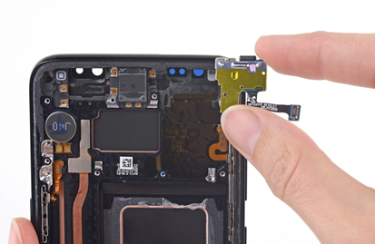

*Sensores*

Los sensores mejoran la experiencia del usuario en múltiples aspectos:  
- Facilitan la **ubicación y navegación**.  
- Habilitan la **interacción contextual** (ajustes automáticos de brillo, rotación, etc.).  
- Permiten la **detección de movimiento y gestos**.  
- Incrementan la **seguridad biométrica**.  
- Contribuyen al **bienestar y la monitorización de la salud**.  
- Optimizan el **consumo de energía y los recursos del sistema**.

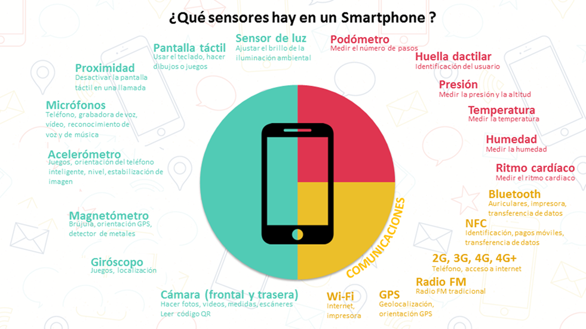

*Tipos de Sensores*

---

## Tipos y Medidas

Los sensores pueden clasificarse según la **magnitud que miden**, el **tipo de señal que generan** o su **función dentro del dispositivo**.  
A continuación, se describen los principales sensores presentes en los dispositivos móviles modernos.

### Sensor de luz
Mide la **intensidad luminosa** del entorno.  
- **Magnitud:** intensidad luminosa.  
- **Unidad:** lux.  
Permite ajustar automáticamente el brillo de la pantalla y optimizar el consumo energético.

---

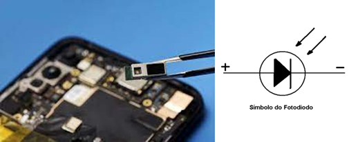

*Sensores de luz*

Proceso

<strong>Elemento sensible:</strong> fotodiodo expuesto a luz

<ol>
<li>Generación de corriente</li>
<li>Condiciones de operación</li>
<li>Acondicionamiento de la señal</li>
<li>Conversión analógico-digital</li>
<li>Procesamiento digital</li>
</ol>

---

### Sensores de pantalla táctil
Permiten detectar la interacción del usuario con la pantalla mediante distintos principios físicos:

- **Capacitivo:** mide variaciones de capacitancia al tocar la superficie.
    - Magnitud: Capacitancia
    - Unidad: Coordenadas X e Y

- **Resistivo:** detecta cambios en la resistencia eléctrica.
    - Magnitud: Resistencia eléctrica en el punto de contacto
    - Unidad: Ohmios

- **Infrarrojo:** identifica interrupciones en haces de luz infrarroja.
    - Magnitud: Interrupción de los rayos infrarrojos
    - Unidad: Coordenadas X e Y medidas en píxeles

- **Óptico:** emplea cámaras y sensores ópticos para detectar la posición del toque.
    - Magnitud: Imágenes y patrones ópticos
    - Unidad: Coordenadas X e Y medidas en píxeles

Todos convierten la señal analógica en coordenadas digitales X e Y que el sistema operativo interpreta.

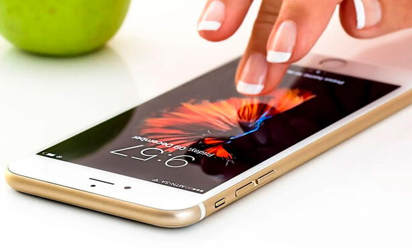

*Sensores de pantalla táctil*

---

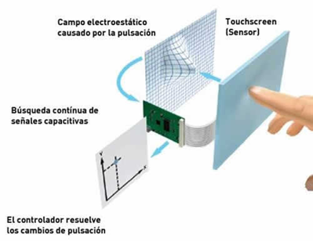

*Sensores de pantalla táctil capacitivos*

---

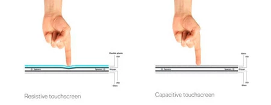

*Sensores de pantalla táctil resistivos*

---

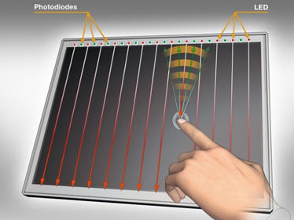

*Sensores de pantalla táctil infrarrojo*

---

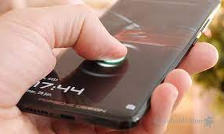

*Sensores de pantalla táctil ópticos*

Proceso

<strong>Elemento sensible:</strong> detección de cambios

<ol>
<li>Mapeo de coordenadas</li>
<li>Conversión analógico-digital</li>
<li>Interpolación y calibración</li>
<li>Actualización continua</li>
<li>Transmisión al Sistema Operativo</li>
</ol>

---

### Sensor de proximidad
Mide la **distancia** entre el dispositivo y un objeto cercano.  
- **Magnitud:** distancia.  
- **Unidad:** centímetros o milímetros.  
Se usa, por ejemplo, para apagar la pantalla durante una llamada al acercar el teléfono al oído.

Proceso

<strong>Elemento sensible:</strong> emisión de luz o ultrasonidos

<ol>
<li>Recepción de señales</li>
<li>Generación de una Señal Analógica</li>
<li>Acondicionamiento de la señal</li>
<li>Conversión analógico-digital</li>
<li>Interpretación en el  Sistema Operativo</li>
<li>Acciones asociadas</li> 
</ol>

---

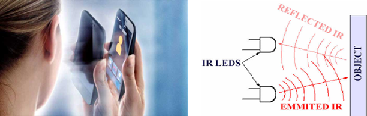

*Sensores de proximidad*

---

### Micrófono
Convierte las **ondas de sonido** en señales eléctricas.  
- **Magnitud:** presión acústica.  
- **Unidad:** pascal (Pa).  
Su procesamiento digital permite grabar, transmitir o interpretar voz y sonidos del entorno.

---

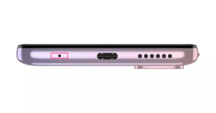

*Micrófono*

Proceso

<strong>Elemento sensible:</strong> sonido

<ol>
<li>Transducción de sonido a señal eléctrica</li>
<li>Amplificación y acondicionamiento de la señal</li>
<li>Conversión analógico-digital</li>
<li>Muestreo y cuantificación</li>
<li>Creación de una representación digital</li>
<li>Almacenamiento o transmisión</li>
<li>Procesamiento digital</li>
</ol>

---

### Acelerómetro
Mide la **aceleración** del dispositivo en los tres ejes espaciales.  
- **Unidad:** metros por segundo al cuadrado (m/s²) o “g” (9.8 m/s²).  
Es esencial para detectar orientación, pasos o movimientos bruscos.

---

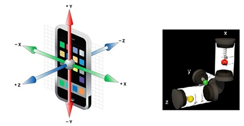

*Representación de un acelerómetro triaxial* - *Representación de un acelerómetro basado en masas y resortes*

---

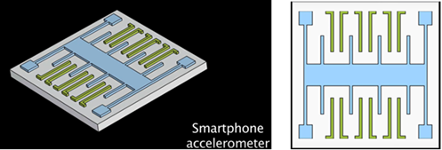

*Estructura MEMS de un acelerómetro* - *Vista esquemática superior MEMS*

Proceso

<strong>Elemento sensible:</strong> aceleración

<ol>
<li>Transducción de la aceleración a señal eléctrica</li>
<li>Amplificación y filtrado</li>
<li>Conversión analógico-digital</li>
<li>Creación de una representación digital</li>
<li>Almacenamiento o transmisión</li>
<li>Procesamiento digital</li>
</ol>

---

### Magnetómetro
Mide la **intensidad del campo magnético**.  
- **Unidad:** microtesla (µT).  
Permite determinar la orientación del dispositivo y sirve de base para las brújulas digitales.

---

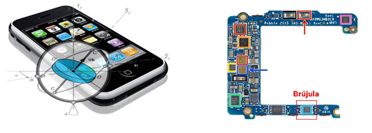

*Magnetrómetro*

Proceso

<strong>Elemento sensible:</strong> Semiconductor donde aparece el voltaje Hall, el campo magnético atraviesa ese semiconductor

<ol>
<li>Transducción de campo magnético a señal eléctrica</li>
<li>Amplificación y filtrado</li>
<li>Conversión analógico-digital</li>
<li>Representación digital</li>
<li>Almacenamiento y transmisión</li>
<li>Interpretación y uso</li>
</ol>

---

### Giroscopio
Mide la **velocidad angular** del dispositivo.  
- **Unidad:** grados por segundo (°/s) o radianes por segundo (rad/s).  
Permite registrar giros, rotaciones y mejorar la precisión del movimiento.

---

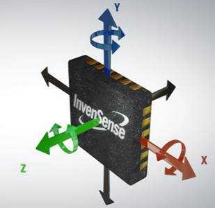

*Giroscopio*

Proceso

<strong>Elemento sensible:</strong> La masa vibratoria MEMS (proof mass) sometida a la fuerza de Coriolis.

<ol>
<li>Transducción</li>
<li>Acondicionamiento de la señal</li>
<li>Conversión analógico-digital</li>
<li>Procesamiento digital</li>
</ol>

---

### Cámaras
Capturan la **luz incidente** mediante sensores de imagen.  
- **Magnitud:** luz visible.  
- **Unidad:** lux.  
Transforman la información óptica en señales digitales que conforman imágenes o vídeo.

---

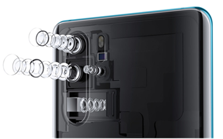

*Cámaras*

Proceso

<strong>Elemento sensible:</strong> Luz capturada por el sensor.

<ol>
<li>Conversión de luz en carga eléctrica</li>
<li>Lectura de carga por filas y columnas</li>
<li>Amplificación y acondicionamiento</li>
<li>Conversión analógico-digital</li>
<li>Creación de una imagen digital</li>
<li>Procesamiento digital</li>
</ol>

---

### Podómetro
Basado en el acelerómetro, mide la **frecuencia de los movimientos** de caminar o correr.  
Se utiliza para contar pasos, estimar distancias y calcular gasto calórico.  
**Unidad**: metros por segundo al cuadrado (m/s²) o en términos de la gravedad terrestre (g), donde 1 g es aproximadamente igual a 9.8 m/s².

---

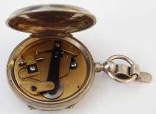

*Podómetro*

---

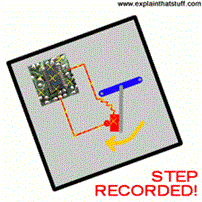

*Podómetro*

---

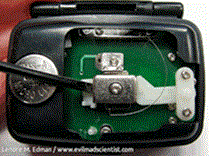

*Podómetro*

Proceso

<strong>Elemento sensible:</strong> La masa inercial del acelerómetro MEMS.

<ol>
<li>Detección del movimiento</li>
<li>Filtrado y procesamiento de datos</li>
<li>Conteo de pasos</li>
<li>Integración temporal</li>
<li>Conversión a datos digitales</li>
<li>Interfaz de usuario</li>
</ol>

---

### Sensor de huella dactilar
Captura la **topografía de la huella** mediante tecnologías ópticas, capacitivas o por ultrasonido.  
Permite la autenticación biométrica segura del usuario.

---

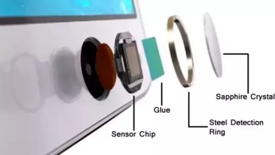

*Huella Dactilar*

---

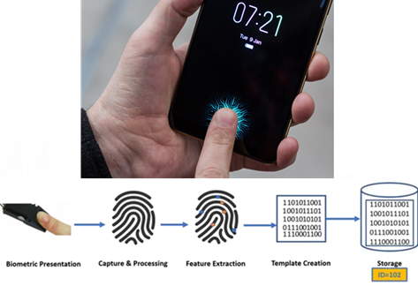

*Huella Dactilar*

Proceso

<strong>Elemento sensible:</strong> Captura de la huella dactilar

<ol>
<li>Creación de una plantilla</li>
<li>Extracción de características</li>
<li>Codificación digital</li>
<li>Almacenamiento y comparación</li>
<li>Algoritmos de coincidencia</li>
<li>Aceptación o rechazo</li>
</ol>

---

### Barómetro
Mide la **presión atmosférica**.  
- **Unidad:** atmósfera o hectopascales (hPa).  
Ayuda a estimar la altitud y a mejorar la precisión de los datos de localización GPS.

---

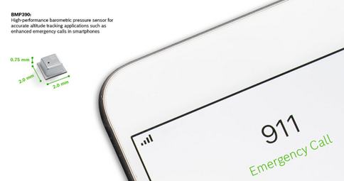

*Barómetro*

Proceso

<strong>Elemento sensible:</strong> Membrana delgada que se deforma -captura de la presión-

<ol>
<li>Compensación de la presión</li>
<li>Conversión analógico-digital</li>
<li>Muestreo y almacenamiento</li>
<li>Cálculo de la altitud</li>
<li>Presentación de datos</li>
</ol>

---

### Termómetro
Mide la **temperatura** del ambiente o del dispositivo.  
- **Unidad:** grados Celsius (°C) o Fahrenheit (°F).  
Es útil para la gestión térmica del sistema y para aplicaciones ambientales.

---

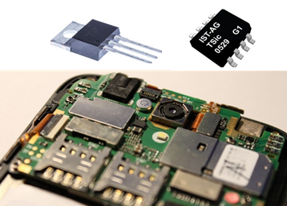

*Termómetro*

Proceso

<strong>Elemento sensible:</strong> Captura de la temperatura

<ol>
<li>Conversión analógico-digital</li>
<li>Muestreo y almacenamiento</li>
<li>Presentación de datos</li>
</ol>

---

### Sensor de humedad
Mide la **humedad relativa del aire**.  
- **Unidad:** porcentaje (% RH).  
Ayuda a registrar las condiciones ambientales y puede integrarse con sensores de temperatura.

---

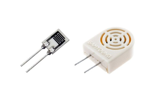

*Sensores de Humedad*

Proceso

<strong>Elemento sensible:</strong> Modificación de material higroscópico

<ol>
<li>Medida del efecto de la humedad sobre el material</li>
<li>Conversión analógico-digital</li>
<li>Almacenamiento y presentación</li>
</ol>

---

### Ritmo cardíaco
Utiliza sensores ópticos basados en **fotopletismografía (PPG)** para detectar cambios en el flujo sanguíneo. 
-**Magnitud:** frecuencia cardíaca  
- **Unidad:** latidos por minuto (bpm).  
Se emplea en relojes inteligentes y dispositivos de monitorización de salud.

---

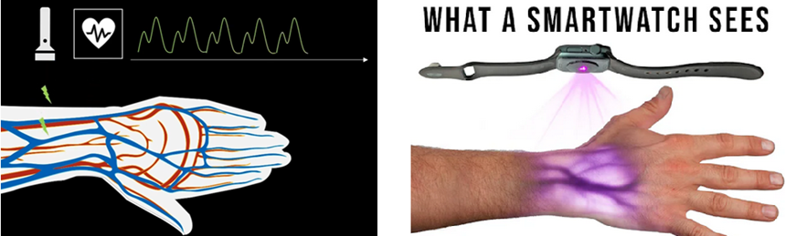

*Ritmo Cardíaco*

Proceso

<strong>Elemento sensible:</strong> Emisión de luz

<ol>
<li>Absorción de luz por la sangre</li>
<li>Detección y conversión a señal eléctrica</li>
<li>Procesamiento de la señal</li>
<li>Cálculo de la frecuencia cardíaca</li>
<li>Presentación de datos</li>
</ol>

---

## Integración y Comunicación de Sensores

### Conectividad y protocolos

Los sensores no solo recopilan datos locales; también se comunican con otros dispositivos y redes mediante diferentes tecnologías:

- **Bluetooth:** permite la conexión inalámbrica de bajo consumo entre sensores y dispositivos cercanos.  
- **NFC (Near Field Communication):** comunicación bidireccional de corto alcance para pagos, identificación o intercambio de información.  
- **Wi-Fi:** conexión a redes locales y a Internet, usada para sincronizar datos y acceder a servicios en la nube.  
- **Radio FM:** permite la recepción de señales de audio en tiempo real mediante un sintonizador interno.  
- **GPS:** determina la ubicación del dispositivo mediante señales satelitales y cálculos de trilateración.

---

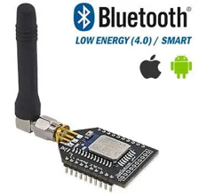

*Bluetooth*

---

*NFC*

---

*Wifi*

---

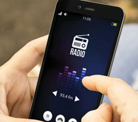

*Radio FM*

---

### Fusión e integración de datos

La **fusión de sensores** combina información de múltiples fuentes (como acelerómetro, giroscopio y magnetómetro) para ofrecer datos más precisos y contextuales.  
Este proceso implica:  
- **Procesamiento conjunto de señales**.    
- **Sincronización temporal** de las lecturas.    
- **Calibración cruzada** para reducir errores.    
- **Integración mediante APIs y bibliotecas** del sistema operativo (como *SensorManager* en Android).  

### Patrones de desarrollo

El uso eficiente de sensores en aplicaciones móviles requiere buenas prácticas de programación:  
- **Gestión de eventos** mediante callbacks u observadores.    
- **Optimización del consumo energético** desactivando sensores cuando no son necesarios.    
- **Manejo de errores y excepciones** en la lectura de datos.   
- **Integración segura** con otras funciones de la app.    
- **Protección de la privacidad del usuario**, asegurando la gestión ética de los datos obtenidos.  

---

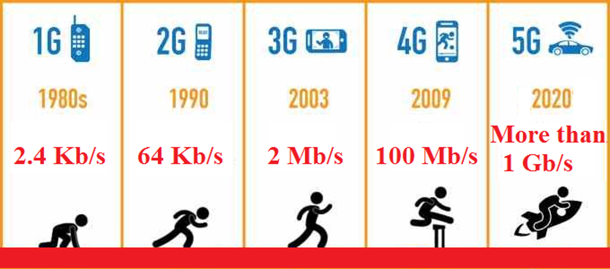

*Evolución de las redes móviles*

---

## Retos Éticos

El uso de sensores plantea **cuestiones éticas y legales** relacionadas con la privacidad y la seguridad de los datos.  

Los principales retos son:  
- **Privacidad:** recopilación de información personal sin consentimiento explícito.    
- **Seguridad:** exposición de datos sensibles a accesos no autorizados.  
- **Sesgos y discriminación:** interpretación inadecuada de datos biométricos o de salud.  
- **Transparencia:** necesidad de explicar cómo se usan los datos y con qué fines.    
- **Impacto ambiental:** consumo energético y desecho de componentes electrónicos.    
- **Accesibilidad:** garantizar que los beneficios de la tecnología sean universales.    
- **Responsabilidad:** definir quién responde ante fallos o mal uso de los datos.    

---

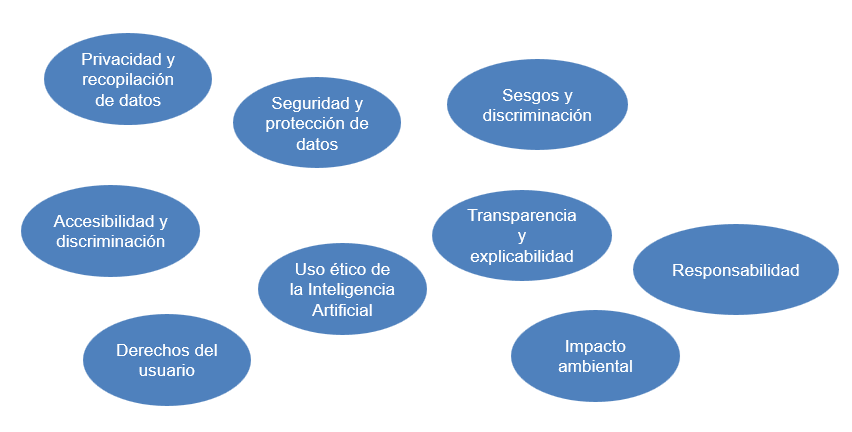

*Retos éticos*

---

## Tendencias Futuras

La evolución tecnológica apunta a sensores **más inteligentes, precisos y sostenibles**, integrados de forma natural en el entorno y en la vida cotidiana.    
Entre las principales tendencias se encuentran:  
- **Sensores especializados y de alta precisión** para aplicaciones médicas y científicas.    
- **Monitorización de salud y bienestar** mediante wearables.    
- **Integración con realidad aumentada y virtual (RA/RV)** para experiencias inmersivas.    
- **Fusión sensorial** para generar información contextual avanzada.    
- **Aplicación de inteligencia artificial** para procesar e interpretar datos en tiempo real.    
- **Interacción sin contacto** (por gestos, voz o proximidad).    
- **Sensores de bajo consumo energético** y **autoalimentados** mediante energía renovable.    
- **Tecnologías sostenibles** para reducir el impacto ambiental.  

---

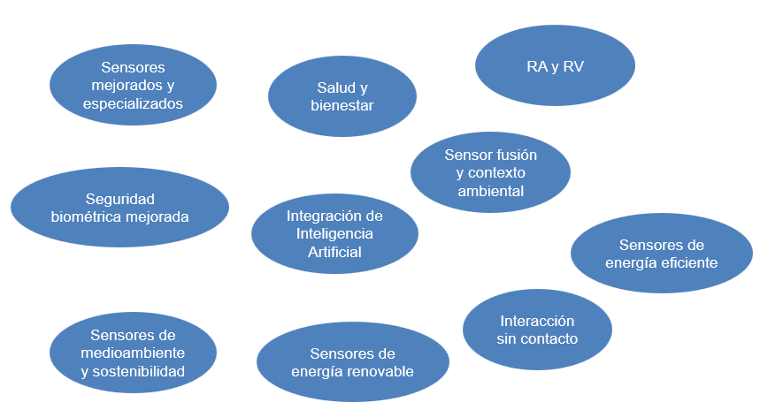

*Tendencias Futuras*

---

## Conclusiones

Los sensores son el puente entre el mundo físico y el digital en las aplicaciones móviles nativas.    
Su capacidad para **percibir, interpretar e integrar datos** hace posible una interacción más natural, segura y personalizada con los dispositivos.    
El futuro de la computación móvil dependerá en gran medida de cómo gestionemos e interpretemos la enorme cantidad de información generada por estos sensores, garantizando siempre un equilibrio entre **innovación, eficiencia y ética tecnológica**.  

[Integración de Datos](integradatos.md "Integración de Datos")
